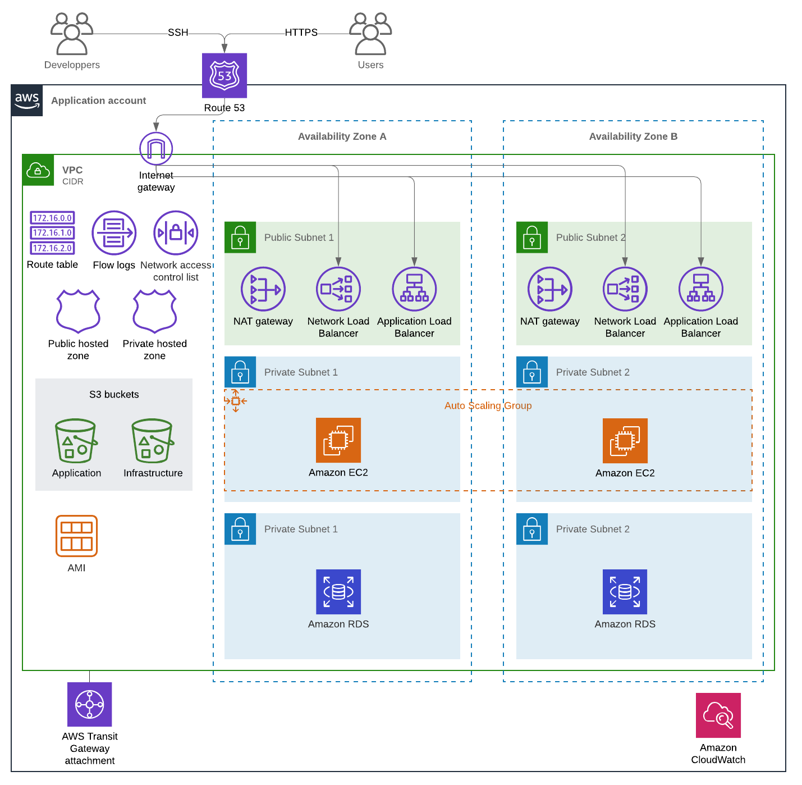

# Generic public stack

This Terraform stack will help you to build a generic Public facing pattern with a RDS instance or a REDSHIFT instance.
All variables are in prd.tfvars , fell free to modify these variables to match your needs. Make sure you change the role into the main.tf file by the role you are using.


## Schema




## Usage

To try this stack just initialize your project

```
terraform init
```
And then you can run terraform plan this way

```
terraform plan   -var-file="prd.tfvars"
```


## Providers

| Name | Version |
|------|---------|
| aws | n/a |
| random | n/a |

## Inputs

| Name | Description | Type | Default | Required |
|------|-------------|------|---------|:-----:|
| alb\_backend\_port | The backend port | `number` | n/a | yes |
| alb\_frontend\_port | The listener frontend port | `number` | n/a | yes |
| application | n/a | `string` | `"generic"` | no |
| asg\_name | Auto scale group name | `string` | `"asg-name"` | no |
| auto\_ingress\_rules | List of ingress rules to add automatically | `list(string)` | <pre>[<br>  "http-80-tcp"<br>]</pre> | no |
| azs | The zone targeted | `list` | <pre>[<br>  "eu-west-3a",<br>  "eu-west-3b"<br>]</pre> | no |
| backup\_windows\_rds | The backup window for RDS | `string` | `"22:00-01:00"` | no |
| database\_name | The postgres RDS database name | `string` | `"rdsinstance"` | no |
| database\_rds\_port | The RDS port | `string` | `"5432"` | no |
| database\_subnets | The database subnet | `list` | <pre>[<br>  "10.9.19.0/24",<br>  "10.9.23.0/24"<br>]</pre> | no |
| database\_username | The RDS database username | `string` | `"myusernametochange"` | no |
| desired\_capacity | The desired capacity of the scaling group | `number` | `1` | no |
| env | The environnement name | `string` | `""` | no |
| extend\_during\_weekdays | n/a | `bool` | `true` | no |
| image\_id | The image ID to deploy | `string` | `""` | no |
| ingress\_rules | List of ingress rules to create by name | `list(string)` | `[]` | no |
| instance\_type | The instance type | `string` | `"t2.medium"` | no |
| maintenance\_window\_rds | The maintenance windows for RDS instance | `string` | `"Sat:02:00-Sat:06:00"` | no |
| max\_size | The Auto scaling group max size | `number` | `1` | no |
| min\_size | The Auto scale min size | `number` | `1` | no |
| nlb\_backend\_port | The backend port | `number` | n/a | yes |
| nlb\_frontend\_port | The listener frontend port | `number` | n/a | yes |
| prefix | The defined prefix to build pattern | `string` | `""` | no |
| private\_subnets | The private subnets | `list` | <pre>[<br>  "10.9.17.0/24",<br>  "10.9.21.0/24"<br>]</pre> | no |
| public\_subnets | the public subnet | `list` | <pre>[<br>  "10.9.16.0/24",<br>  "10.9.20.0/24"<br>]</pre> | no |
| rds\_backup\_retention\_period | The backup retention days | `number` | `30` | no |
| rds\_encrypted | Activate or not the RDS | `bool` | `true` | no |
| rds\_engine | The RDS engine | `string` | `"postgres"` | no |
| rds\_engine\_version | The RDS engine version | `string` | `"9.6.15"` | no |
| rds\_family\_instance | The RDS family instance | `string` | `"postgres9.6"` | no |
| rds\_identifier | The RDS identifiers | `string` | `"db-ha"` | no |
| rds\_instance\_class | The RDS instance class | `string` | `"db.t3.small"` | no |
| rds\_instance\_storage | The RDS storage provision | `number` | `2000` | no |
| rds\_major\_version | The RDS major version | `string` | `"9.6"` | no |
| rds\_monioring\_role | The RDS monitoring role | `string` | `"RDSMonitoringRole"` | no |
| rds\_monitoring\_interval | The monitoring interval | `number` | `0` | no |
| rds\_role\_arn | n/a | `string` | `""` | no |
| rds\_sio1\_iops | The iops configuration for RDS instance | `number` | `10000` | no |
| rds\_storage\_type | The storage type | `string` | `"io1"` | no |
| redshift\_cluster\_identifier | The redshift identifier | `string` | `"redshift-cluster"` | no |
| redshift\_cluster\_name | The Redshift cluster name | `string` | `"dataiku_production_db"` | no |
| redshift\_cluster\_node\_number | The nomber of node | `number` | `1` | no |
| redshift\_node\_type | The Redshift node type | `string` | `"dc2.large"` | no |
| redshift\_subnets | The redshift subnets | `list` | <pre>[<br>  "10.9.18.0/24",<br>  "10.9.22.0/24"<br>]</pre> | no |
| redshift\_user\_name | The Redshift username | `string` | `"mydbuser"` | no |
| region | The region name | `string` | `""` | no |
| region\_trigram | The region trigram to build pattern | `string` | `""` | no |
| vpc\_cidr | The main CIDR for VPC | `string` | `"10.9.16.0/21"` | no |

## Outputs

| Name | Description |
|------|-------------|
| alb | Everything output by the alb module |
| asb | Everything output by the asg module |
| block\_cidr\_vpc | n/a |
| cgw\_ids | List of IDs of Customer Gateway |
| http\_sg | Everything output by the http\_sg module |
| key\_pair\_admin | Everything output by the key\_pair\_admin module |
| nat\_gateways\_eips | The Elastic IPs of the NAT gateways in the private subnets |
| nlb | Everything output by the nlb module |
| rds\_password | n/a |
| s3\_app\_arn | n/a |
| s3\_app\_id | n/a |
| ssh\_sg | Everything output by the ssh\_sg module |
| this\_customer\_gateway | Map of Customer Gateway attributes |
| this\_key\_pair\_fingerprint | The MD5 public key fingerprint as specified in section 4 of RFC 4716. |
| vpc | Everything output by the vpc module |
